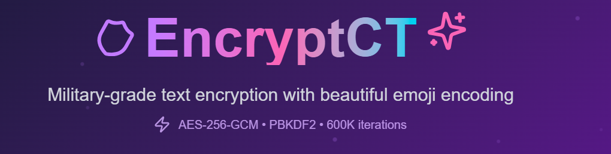
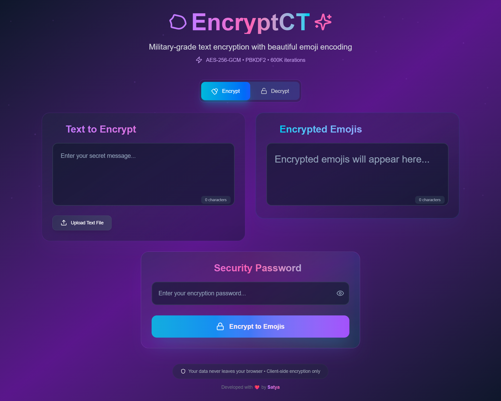
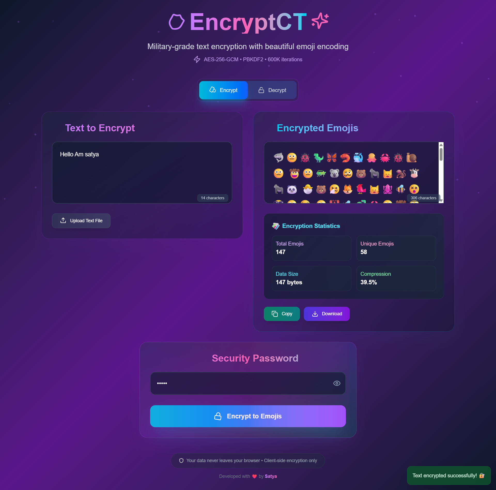

# 🔐 EncryptCT ✨

<div align="center">
  
</div>

**Military-grade text encryption with beautiful emoji encoding**

[](https://emoji-encrypt-x.vercel.app/)
[](https://www.typescriptlang.org/)
[](https://nextjs.org/)
[](https://tailwindcss.com/)

## 🌟 Overview

EncryptCT is a cutting-edge web application that transforms your sensitive text into beautiful emoji sequences using military-grade encryption. Built with security-first principles, it ensures your data never leaves your browser while providing an intuitive and visually appealing encryption experience.

## 🚀 Live Demo

**[Try EncryptCT Now →](https://emoji-encrypt-x.vercel.app/)**

## 📸 Screenshots

<div align="center">

### 🔐 Encryption Interface

*Beautiful interface for encrypting your text into emoji sequences*

### ✨ Encrypted Result with Statistics  

*Your text transformed into colorful emojis with detailed encryption statistics*

</div>

## ✨ Features

### 🔒 **Military-Grade Security**
- **AES-256-GCM Encryption**: The gold standard for symmetric encryption
- **PBKDF2 Key Derivation**: 600,000 iterations following OWASP 2024 standards
- **Cryptographically Secure Random Generation**: For salts and initialization vectors
- **Authenticated Encryption**: Tamper-proof with 128-bit authentication tags
- **Client-Side Only**: Your data never touches any server

### 🎨 **Beautiful User Experience**
- **Emoji Encoding**: Transform encrypted data into colorful emoji sequences
- **Dark Theme**: Modern, eye-friendly interface with purple gradients
- **Smooth Animations**: Powered by Framer Motion for delightful interactions
- **Responsive Design**: Perfect on desktop, tablet, and mobile devices
- **Real-time Statistics**: See encryption metrics and emoji analysis

### 🛡️ **Advanced Features**
- **Dual Mode Interface**: Easy switching between encrypt and decrypt modes
- **File Support**: Upload text files and download encrypted/decrypted results
- **Copy & Share**: One-click copying of encrypted emoji sequences
- **Password Flexibility**: Accept any length passwords for maximum flexibility
- **Error Handling**: Comprehensive validation and user-friendly error messages

## 🛡️ Security Architecture

### Encryption Process
1. **Password Validation** - Ensures strong password policies
2. **Salt Generation** - 256-bit cryptographically secure random salt
3. **Key Derivation** - PBKDF2 with SHA-256 and 600K iterations
4. **AES-256-GCM Encryption** - Authenticated encryption with 128-bit tag
5. **Emoji Encoding** - Binary-to-emoji conversion using 256-emoji alphabet
6. **Formatting** - Grouped display for better readability

### Decryption Process
1. **Emoji Parsing** - Convert formatted emojis back to binary
2. **Data Reconstruction** - Rebuild encryption components
3. **Authentication** - Verify data integrity using GCM tag
4. **Key Derivation** - Same PBKDF2 process with provided password
5. **AES-256-GCM Decryption** - Authenticated decryption
6. **Text Recovery** - UTF-8 decoding of plaintext

## � Getting Started

### Prerequisites
- Node.js 18+ 
- npm or yarn
- HTTPS development environment (for Web Crypto API)

### Installation

1. **Clone the repository**
   ```bash
   git clone https://github.com/Satyasuranjeet/emoji-encrypt-x.git
   cd emoji-encrypt-x
   ```

2. **Install dependencies**
   ```bash
   npm install
   # or
   yarn install
   ```

3. **Set up HTTPS for development**
   ```bash
   # Install mkcert for local HTTPS
   npm install -g mkcert
   mkcert create-ca
   mkcert create-cert
   ```

4. **Start the development server**
   ```bash
   npm run dev
   # or
   yarn dev
   ```

5. **Open your browser**
   Navigate to `https://localhost:3000`

## 🔧 Technical Architecture

### **Frontend Stack**
- **Next.js 15.4.3**: React framework with App Router
- **TypeScript**: Type-safe development
- **Tailwind CSS**: Utility-first styling
- **Framer Motion**: Advanced animations and micro-interactions

### **Security Implementation**
- **Web Crypto API**: Browser-native cryptographic operations
- **HTTPS Required**: Secure context for crypto operations
- **Memory Clearing**: Best-effort sensitive data cleanup
- **Constant-Time Operations**: Protection against timing attacks

### **Emoji Encoding System**
- **256-Emoji Alphabet**: Diverse set of emojis for visual appeal
- **Unicode Normalization**: NFC normalization for consistency
- **Base64 Conversion**: Efficient binary-to-emoji transformation
- **Compression Statistics**: Real-time analysis of encoding efficiency

##  Project Structure

```
src/
├── app/
│   ├── page.tsx              # Main application component
│   ├── layout.tsx            # Root layout
│   └── globals.css           # Global styles
├── lib/
│   ├── crypto.ts             # Encryption/decryption logic
│   ├── emoji-encoder.ts      # Emoji encoding system
│   └── utils.ts              # Utility functions
└── components/               # Reusable components
```

## 🔐 Security Features Deep Dive

### **Encryption Process**
1. **Password Input**: Any length password accepted
2. **Salt Generation**: 32-byte cryptographically secure random salt
3. **Key Derivation**: PBKDF2 with SHA-256, 600K iterations
4. **IV Generation**: 12-byte random initialization vector
5. **AES-256-GCM Encryption**: Authenticated encryption with 128-bit tag
6. **Emoji Encoding**: Binary data transformed to emoji sequence

### **Security Guarantees**
- ✅ **Confidentiality**: AES-256 encryption protects data content
- ✅ **Integrity**: GCM authentication prevents tampering
- ✅ **Authenticity**: Authentication tag verifies data origin
- ✅ **Forward Secrecy**: New salt/IV for each encryption
- ✅ **Client-Side Only**: Zero server-side data exposure

## 🎨 Design Philosophy

### **User-Centric Design**
- **Intuitive Interface**: Clear visual hierarchy and user flow
- **Immediate Feedback**: Real-time validation and status updates
- **Accessibility**: Keyboard navigation and screen reader support
- **Performance**: Optimized animations and efficient rendering

### **Visual Identity**
- **Color Palette**: Purple, pink, and cyan gradients
- **Typography**: Clean, modern font choices
- **Iconography**: Lucide React icons for consistency
- **Animations**: Subtle micro-interactions for engagement

## 📊 Performance Metrics

- **Encryption Speed**: ~50-100ms for typical text lengths
- **Bundle Size**: Optimized for fast loading
- **Mobile Performance**: Smooth on low-end devices
- **Memory Usage**: Efficient with automatic cleanup

## 🤝 Contributing

Contributions are welcome! Please feel free to submit a Pull Request. For major changes, please open an issue first to discuss what you would like to change.

### **Development Guidelines**
- Follow TypeScript best practices
- Maintain security-first approach
- Test on multiple devices and browsers
- Keep animations smooth and performant

## � License

This project is licensed under the MIT License - see the [LICENSE](LICENSE) file for details.

## 👨‍💻 Developer

**Developed with ❤️ by [Satya](https://github.com/Satyasuranjeet)**

## 🔗 Links

- **Live Demo**: [https://emoji-encrypt-x.vercel.app/](https://emoji-encrypt-x.vercel.app/)
- **Repository**: [https://github.com/Satyasuranjeet/emoji-encrypt-x](https://github.com/Satyasuranjeet/emoji-encrypt-x)
- **Issues**: [Report bugs or request features](https://github.com/Satyasuranjeet/emoji-encrypt-x/issues)

## ⚠️ Security Notice

This application is designed for educational and personal use. While it implements strong cryptographic standards, please ensure you understand the security implications before using it for highly sensitive data. The security of your data depends on:

- **Password Strength**: Use strong, unique passwords
- **Browser Security**: Keep your browser updated
- **Device Security**: Secure your local device
- **HTTPS Usage**: Always use the HTTPS version

---

**Made with 🔐 for a more secure digital world**

## 🔮 Future Enhancements

- [ ] Multiple encryption algorithms support
- [ ] Bulk file processing
- [ ] Password manager integration
- [ ] Mobile app version
- [ ] Offline PWA functionality
- [ ] Advanced emoji customization
- [ ] Enterprise security features

---

**Remember**: The security of your data is only as strong as your password. Use long, unique passwords and store them securely! 🔐
